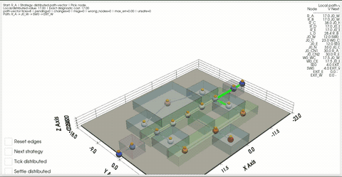
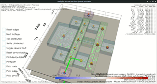
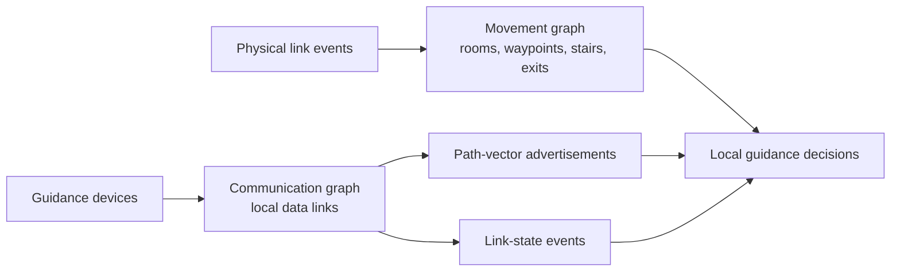
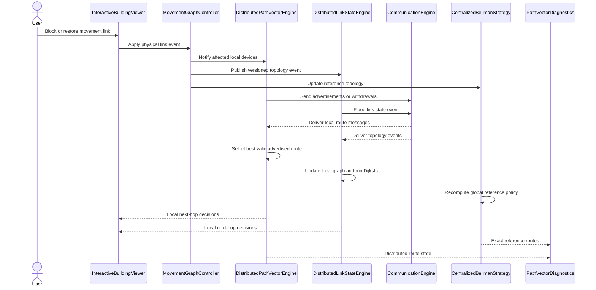
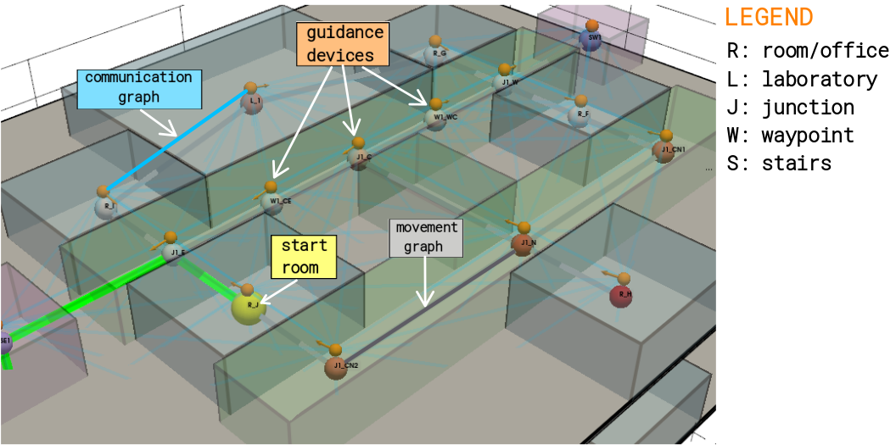
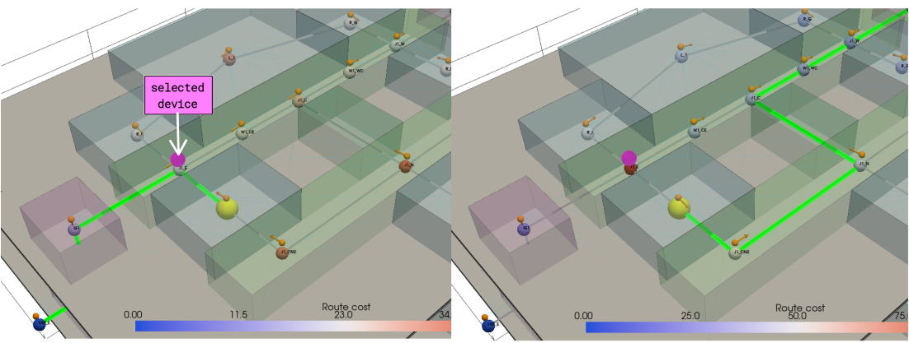

# Navilight

| Single-floor link failure, gossip visualization | Two spreading fires and exit closure; two-floor rerouting. |
|-------|-------|
|  |  |


**Navilight** is a proof-of-concept for **distributed adaptive evacuation guidance** in smart buildings. Distributed guidance devices exchange local information and update the direction shown to evacuees when corridors, stairs or exits become unavailable.

The project separates the **movement graph**, which describes where people can walk, from the **communication graph**, which describes which devices can exchange messages. This distinction allows the prototype to model realistic cases in which two devices can communicate without controlling adjacent movement nodes, or a physical route changes while communication remains available.

`navilight.py` contains the complete model, routing strategies and interactive PyVista visualizer. The implementation compares two distributed approaches:

- **Path-vector-style routing:** exits originate route advertisements. Each device selects a route received from a device controlling a physically adjacent waypoint, adds the local movement cost and advertises the resulting path. Explicit path information prevents routing loops, while withdrawals propagate unavailable routes.
- **Link-state-style routing:** devices propagate versioned link and device events over the communication graph. Each device maintains a local view of the known movement topology and independently computes its guidance decision with Dijkstra's algorithm.

A centralized Bellman strategy is included as an observer-side reference for validation. It is not used by the distributed devices.

> **Note:** Device-failure handling is currently implemented only by the link-state strategy. The path-vector strategy reacts to movement-link failures but does not model failed guidance devices.

| Layer                         | Main components                                                        | Responsibility                                                                              |
| ----------------------------- | ---------------------------------------------------------------------- | ------------------------------------------------------------------------------------------- |
| Building geometry             | `BuildingGeometry`, `Space`                                            | Builds and renders floors, rooms, corridors and stairs                                      |
| Movement topology             | `networkx.Graph`, `MovementGraphController`                            | Represents weighted walkable links and applies versioned physical events                    |
| Guidance devices              | `GuidanceDevice`                                                       | Associates each physical indicator with an explicit routing waypoint                        |
| Communication topology        | `CommunicationEngine`                                                  | Builds and validates local communication links between devices                              |
| Path-vector routing           | `DistributedPathVectorEngine`, `RouteAgentState`, `RouteAdvertisement` | Stores local routing state and propagates selected routes or withdrawals in protocol rounds |
| Link-state routing            | `DistributedLinkStateEngine`                                           | Propagates versioned topology events and computes shortest paths from each local graph view |
| Strategy adapters             | `DistributedPathVectorStrategy`, `DistributedLinkStateStrategy`        | Expose distributed routing decisions to the visualizer                                      |
| Reference and diagnostics     | `CentralizedBellmanStrategy`, `PathVectorDiagnostics`                  | Computes the global reference policy and compares it with distributed routes                |
| Interaction and visualization | `InteractiveBuildingViewer`                                            | Handles edge blocking, protocol stepping, route inspection and 3D rendering                 |


A movement node is a **routing state**, not necessarily a semantic place. Corridor-mounted indicators are represented by explicit `waypoint` nodes at their physical locations.

### Two distinct graphs



The communication graph transports routing information only. A device can direct evacuees toward another device only when their controlled movement nodes are connected by an available physical link.

### Component interaction



-------------------
## Distributed strategies

Let the movement graph be

$$
G_{\mathrm{move}}=(V_{\mathrm{move}},E_{\mathrm{move}},w),
$$

where $V_{\mathrm{move}}$ contains movement nodes, $E_{\mathrm{move}}$ contains currently available movement links and $w(u,v)>0$ is the cost of traversing link $(u,v)$.

Let $\mathcal{D}$ be the set of guidance devices. Device $i\in\mathcal{D}$ controls movement node $x_i\in V_{\mathrm{move}}$. Devices exchange messages through a separate communication graph. The communication neighbours of device $i$ are denoted by $\mathcal{N}^{\mathrm{comm}}_i$.

The implementation stores the original movement topology $E_{\mathrm{move}}^0$ in a NetworkX graph and marks unavailable links as blocked. Therefore, the currently available set is represented as

$$
E_{\mathrm{move}}=
\\{
\ell\in E_{\mathrm{move}}^0
\ | \
\ell\text{ is not blocked}
\\}.
$$

### Path-vector-style

Each exit device originates a route with cost zero. Other devices receive route advertisements, evaluate the routes available through their neighbours and advertise their selected route. The proof-of-concept executes this process as logical protocol rounds in one thread: all inboxes are processed, all devices update their selected routes and changed routes are then broadcast.

The latest advertisement received from device $j$ contains:

* $d_j$: the total cost from $x_j$ to an exit;
* $P_j$: the ordered sequence of movement nodes forming that route.

Advertisements also carry a monotonically increasing local generation number. Device $i$ retains an advertisement from $j$ only when its generation is newer than the previously received generation from that device.

Device $i$ can use an advertisement from $j$ only if the devices can communicate, their controlled movement nodes are connected by an available movement link, the advertised path is already loop-free and adding $x_i$ would not create a loop:

$$
\mathcal{C}_i =
\\{
j \in \mathcal{N}^{\mathrm{comm}}_i
\ | \
(x_i,x_j)\in E_{\mathrm{move}},
\quad x_i\notin P_j,
\quad P_j\text{ is loop-free},
\quad d_j<\infty
\\}
$$

Therefore, $\mathcal{C}_i$ is the set of valid next-device candidates currently known by device $i$.

For each candidate $j\in\mathcal{C}_i$, device $i$ prepends its movement node to the advertised path and adds the cost of the local movement link:

$$
d_i(j)=w(x_i,x_j)+d_j,
\qquad
P_i(j)=(x_i)\mathbin{|}P_j,
$$

where $\mathbin{|}$ denotes sequence concatenation. Thus, $d_i(j)$ is the complete route cost obtained by first moving from $x_i$ to $x_j$ and then following the route advertised by $j$.

Device $i$ selects the candidate with the lowest total cost:

$$
j_i^\star =
\underset{j\in\mathcal{C}_i}{{\arg\min}_{\mathrm{lex}}}
\left(d_i(j),x_j\right).
$$

Thus, the implemented deterministic tie-breaking key is $\tau(j,P_j)=x_j$: $\arg\min_{\mathrm{lex}}$ compares the route cost first and the next device's controlled movement-node identifier second. This ensures that equal-cost routes produce a stable decision.

The selected guidance next hop is $x_{j_i^\star}$, and device $i$ advertises

$$
\left(d_i(j_i^\star),P_i(j_i^\star)\right).
$$

If $\mathcal{C}_i=\varnothing$, no valid exit route is currently known. Device $i$ removes its guidance decision and propagates an explicit withdrawal.

The resulting next-hop policy is computed using only local communication and received advertisements. During propagation, devices may temporarily hold different route views. After all relevant messages have been processed, the distributed routes can be compared with the centralized reference.

### Link-state-style

In the link-state strategy, every device starts with the known original movement topology $E_{\mathrm{move}}^0$. Devices then propagate versioned events describing blocked or restored movement links and failed or recovered devices.

A movement-link event is represented as

$$
e=(\ell,s,\nu),
$$

where:

* $\ell\in E_{\mathrm{move}}^{0}$ identifies a link in the original movement topology;
* $s\in\{\mathrm{available},\mathrm{blocked}\}$ is its new state;
* $\nu\in\mathbb{N}$ is its monotonically increasing version;
* $E_{\mathrm{move}}^{0}$ is the set of all movement links before dynamic failures are applied.

Let $\nu_i(\ell)$ be the latest version of link $\ell$ known by device $i$. A strictly newer event is applied and forwarded when

$$
\nu>\nu_i(\ell).
$$

Events with $\nu<\nu_i(\ell)$ and equal-version reports that agree with the known state are ignored. If two reports with the same version disagree, the implementation records a conflict, conservatively selects the blocked state and floods the resolved event. A strictly newer version supersedes this conflict.

A device-availability event is represented as

$$
e_{\mathrm{dev}}=(j,f,\nu),
$$

where $j\in\mathcal{D}$ identifies the subject device, $f\in\{\mathrm{active},\mathrm{failed}\}$ is its new state and $\nu\in\mathbb{N}$ is its monotonically increasing status version. Let $\nu_i^{\mathrm{dev}}(j)$ be the latest status version for $j$ known by device $i$. Device-event conflicts use the same version rules and conservatively select the failed state. Failure events are injected at live communication neighbours after heartbeat-style detection; when a device recovers, peers also synchronize their known event databases with it.

After applying its known events, device $i$ maintains a local movement graph

$$
G_i=(V_i,E_i,w),
$$

where $V_i\subseteq V_{\mathrm{move}}$ excludes movement nodes controlled by devices that $i$ currently considers failed, and $E_i\subseteq E_{\mathrm{move}}^{0}$ contains the links that $i$ currently considers available whose endpoints belong to $V_i$.

Let $X\subseteq V_{\mathrm{move}}$ be the set of exit nodes and $X_i=X\cap V_i$ the exits present in device $i$'s local graph. Using multi-source Dijkstra's algorithm, device $i$ computes the shortest known distance from any movement node $v\in V_i$ to an exit:

$$
D_i(v)=
\min_{x\in X_i}
\text{dist}_{G_i}(v,x),
$$

where $\text{dist}_{G_i}(v,x)$ is the shortest-path cost from $v$ to exit $x$ in device $i$'s local graph. If no exit is reachable, this distance is $\infty$.

From its controlled node $x_i$, device $i$ selects the available neighbour that minimizes the complete remaining route cost:

$$
u_i^\star =
\underset{u:(x_i,u)\in E_i,\;D_i(u)<\infty}{{\arg\min}_{\mathrm{lex}}}
\left(
w(x_i,u)+D_i(u),
\tau(u)
\right),
$$

where $\tau(u)$ is a deterministic tie-breaking key. The selected neighbour $u_i^\star$ becomes the displayed guidance direction. If no neighbour has finite remaining cost, the device exposes no valid guidance hop.

For each neighbour $u$ satisfying $w(x_i,u)+D_i(u)=D_i(x_i)$, let $\xi_i(u)\in X_i$ be the exit selected by the already computed downstream policy from $u$. The implementation uses

$$
\tau(u)=\left(\xi_i(u),u\right),
$$

so equal-cost routes are resolved first by the downstream exit identifier and then by the neighbouring movement-node identifier.

Once all relevant events have propagated, devices holding the same topology and device-availability state construct the same local graph and compute the same deterministic shortest-path policy. If failures partition the live communication graph, devices in different components may retain different local views.

## Run

Requirements:

- Python 3
- A graphical environment supported by PyVista

```bash
python -m venv .venv
source .venv/bin/activate
python -m pip install -r requirements.txt
```

Start the interactive visualizer:

```bash
python navilight.py
```

Run the Qt recording scenarios:

```bash
# One floor and one protocol tick per update, to show gossip propagation
python recorded_demo_qt.py --preset slow-one-floor

# Two-floor dynamic evacuation with multiple spreading failures
python recorded_demo_qt.py --preset normal-dynamic

# Two-floor isolation and recovery limit test
python recorded_demo_qt.py --preset fast-two-floor
```

For recording, `--manual-start` keeps the scenario paused while the camera is positioned. `--start-delay-frames N` adds a fixed delay before the first physical event. `--ticks-per-update` controls protocol progress between redraws; using several ticks per update represents fast device communication without requiring equally frequent PyVista rendering.

```bash
pytest -q
```

The protocol tests verify route propagation, withdrawal handling, deterministic routing and agreement with the centralized reference after settlement.

## UI interactions

| UI meaning | Inject fault in a device |
|-------|-------|
|  |  |

| Action | Effect |
|---|---|
| Reset edges | Restore all physical movement links |
| Next strategy | Switch between distributed strategies and the centralized reference |
| Tick distributed | Advance one distributed message and update tick |
| Settle distributed | Run until no pending route updates remain |
| Toggle device fault | Toggle device fault for selected device |
| Print device table | Print each device's selected local route state |
| Print path | Print the displayed route and exact diagnostic cost |
| Pick node | Select a room as the displayed route origin |
| Pick edge | Toggle a physical movement link blocked or unblocked |
| Pick device | Select device mode |


Rendering conventions:

| Colour | Meaning |
|---|---|
| Orange arrow | Local distributed guidance decision |
| Blue arrow | Centralized reference policy |
| Yellow sphere | Selected start node |
| Green path | Route from the selected start node |
| Red edge | Blocked movement link |
| Cyan link | Communication graph edge |
| Magenta sphere | Selected device to toggle faults |
