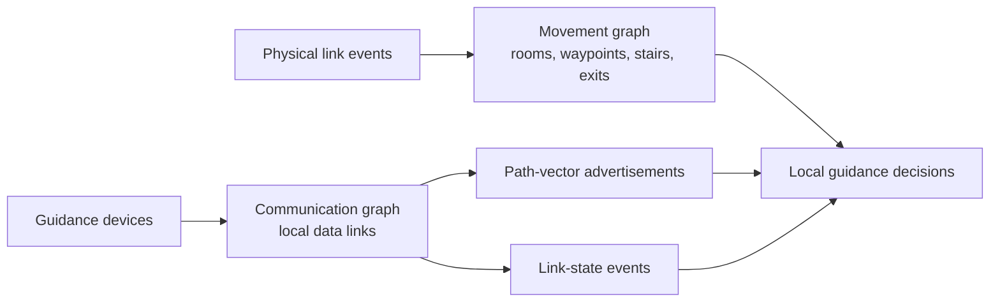
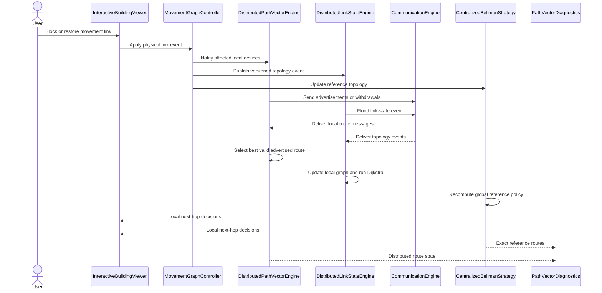

# Navilight

| Single-floor link failure | Two spreading fires and exit closure; two-floor rerouting. |
|-------|-------|
|  |  |


**Navilight** is a proof-of-concept for **distributed adaptive evacuation guidance** in smart buildings. Distributed guidance devices exchange local information and update the direction shown to evacuees when corridors, stairs or exits become unavailable.

The project separates the **movement graph**, which describes where people can walk, from the **communication graph**, which describes which devices can exchange messages. This distinction allows the prototype to model realistic cases in which two devices can communicate without controlling adjacent movement nodes, or a physical route changes while communication remains available.

`navilight.py` contains the complete model, routing strategies and interactive PyVista visualizer. The implementation compares two distributed approaches:

- **Path-vector-style routing:** exits originate route advertisements. Each device selects a route received from a device controlling a physically adjacent waypoint, adds the local movement cost and advertises the resulting path. Explicit path information prevents routing loops, while withdrawals propagate unavailable routes.
- **Link-state-style routing:** devices propagate versioned link and device events over the communication graph. Each device maintains a local view of the known movement topology and independently computes its guidance decision with Dijkstra's algorithm.

A centralized Bellman strategy is included as an observer-side reference for validation. It is not used by the distributed devices.

| Layer                         | Main components                                                        | Responsibility                                                                              |
| ----------------------------- | ---------------------------------------------------------------------- | ------------------------------------------------------------------------------------------- |
| Building geometry             | `BuildingGeometry`, `Space`                                            | Builds and renders floors, rooms, corridors and stairs                                      |
| Movement topology             | `networkx.Graph`, `MovementGraphController`                            | Represents weighted walkable links and applies versioned physical events                    |
| Guidance devices              | `GuidanceDevice`                                                       | Associates each physical indicator with an explicit routing waypoint                        |
| Communication topology        | `CommunicationEngine`                                                  | Builds and validates local communication links between devices                              |
| Path-vector routing           | `DistributedPathVectorEngine`, `RouteAgentState`, `RouteAdvertisement` | Stores local routing state and asynchronously propagates selected routes or withdrawals     |
| Link-state routing            | `DistributedLinkStateEngine`                                           | Propagates versioned topology events and computes shortest paths from each local graph view |
| Strategy adapters             | `DistributedPathVectorStrategy`, `DistributedLinkStateStrategy`        | Expose distributed routing decisions to the visualizer                                      |
| Reference and diagnostics     | `CentralizedBellmanStrategy`, `PathVectorDiagnostics`                  | Computes the global reference policy and compares it with distributed routes                |
| Interaction and visualization | `InteractiveBuildingViewer`                                            | Handles edge blocking, protocol stepping, route inspection and 3D rendering                 |


A movement node is a **routing state**, not necessarily a semantic place. Corridor-mounted indicators are represented by explicit `waypoint` nodes at their physical locations.

### Two distinct graphs



The communication graph transports routing information only. A device can direct evacuees toward another device only when their controlled movement nodes are connected by an available physical link.

### Component interaction


<!--
## Distributed strategies

### Path-vector-style

Each exit originates a zero-cost route. Devices process advertisements "asynchronously", reject routes containing their own identifier, add the cost of the corresponding movement link and select the best valid route using deterministic tie-breaking. Changes are propagated as updated advertisements or explicit withdrawals.

Let $x_i$ be the movement node controlled by device $i$. An advertisement received from device $j$ contains its selected cost $d_j$ and path $P_j$. Device $i$ accepts it as a candidate only when the corresponding movement link is available and the resulting path is loop-free:

$$
\mathcal{C}_i =
\left\{
j \in \mathcal{N}^{\mathrm{comm}}_i
\;\middle|\;
(x_i,x_j) \in E_{\mathrm{move}},\;
i \notin P_j
\right\}.
$$

For every valid candidate, the cost through $j$ is

$$
d_i(j) = w(x_i,x_j) + d_j,
\qquad
P_i(j) = (i) \mathbin{\|} P_j.
$$

The selected route is the minimum-cost candidate, with a deterministic secondary key $\tau$ resolving equal-cost alternatives:

$$
j_i^\star =
\underset{j \in \mathcal{C}_i}{\arg\min}
\left(d_i(j), \tau(j,P_j)\right).
$$

If $\mathcal{C}_i=\varnothing$, device $i$ has no valid route and advertises an explicit withdrawal. Otherwise, it advertises $\left(d_i(j_i^\star),P_i(j_i^\star)\right)$.

The result is a distributed next-hop policy built from local state and local communication. During propagation, devices may temporarily hold different views; after messages settle in a connected communication component, their selected routes can be compared with the centralized reference.

### Link-state-style

Devices start from the known static movement topology and distribute versioned events describing blocked or restored links and device availability. Each device applies the newest events received through local communication, updates its local topology and runs Dijkstra to select the next movement hop.

A physical change is represented by a versioned event

$$
e = (\ell, s, \nu),
$$

where $\ell$ identifies a movement link, $s$ is its new state and $\nu$ is a monotonically increasing version. Device $i$ applies the event only when

$$
\nu > \nu_i(\ell),
$$

then forwards it through the communication graph. This rule makes repeated and out-of-order deliveries idempotent.

Let $G_i=(V,E_i)$ be device $i$'s local movement graph after applying its known events, and let $X\subseteq V$ be the exits. The local distance to safety is

$$
D_i(v) = \min_{x \in X} \operatorname{dist}_{G_i}(v,x).
$$

For the controlled node $x_i$, the guidance decision is the available neighbour

$$
u_i^\star =
\underset{u:(x_i,u)\in E_i}{\arg\min}
\left(w(x_i,u)+D_i(u), \tau(u)\right),
$$

again using deterministic tie-breaking. If no exit is reachable, the device exposes no valid guidance hop.

Once all relevant events have propagated, devices with the same topology state compute the same deterministic shortest-path policy.
-->

-------------------
## Distributed strategies

Let the movement graph be

$$
G_{\mathrm{move}}=(V_{\mathrm{move}},E_{\mathrm{move}},w),
$$

where $V_{\mathrm{move}}$ contains routing waypoints, $E_{\mathrm{move}}$ contains currently available movement links and $w(u,v)>0$ is the cost of traversing link $(u,v)$.

Let $\mathcal{D}$ be the set of guidance devices. Device $i\in\mathcal{D}$ controls movement node $x_i\in V_{\mathrm{move}}$. Devices exchange messages through a separate communication graph. The communication neighbours of device $i$ are denoted by $\mathcal{N}^{\mathrm{comm}}_i$.

### Path-vector-style

Each exit device originates a route with cost zero. Other devices "asynchronously" (*actually is all is happening sequentially in a single thread*) receive route advertisements, evaluate the routes available through their neighbours and advertise their selected route.

The latest advertisement received from device $j$ contains:

* $d_j$: the total cost from $x_j$ to an exit;
* $P_j$: the ordered sequence of movement nodes forming that route.

Device $i$ can use an advertisement from $j$ only if the devices can communicate, their controlled movement nodes are connected by an available movement link and adding $x_i$ would not create a loop:

$$
\mathcal{C}_i =
\left\{
j \in \mathcal{N}^{\mathrm{comm}} \ | \ 
(x_i,x_j) \in E_{\mathrm{move}} ,
\quad
x_i \notin P_j,
\quad
d_j < \infty
\right\}.
$$

Therefore, $\mathcal{C}_i$ is the set of valid next-device candidates currently known by device $i$.

For each candidate $j\in\mathcal{C}_i$, device $i$ prepends its movement node to the advertised path and adds the cost of the local movement link:

$$
d_i(j)=w(x_i,x_j)+d_j,
\qquad
P_i(j)=(x_i)\mathbin{|}P_j,
$$

where $\mathbin{|}$ denotes sequence concatenation. Thus, $d_i(j)$ is the complete route cost obtained by first moving from $x_i$ to $x_j$ and then following the route advertised by $j$.

Device $i$ selects the candidate with the lowest total cost:

$$
j_i^\star =
\underset{j\in\mathcal{C}*i}{{\arg\min}_{\mathrm{lex}}}
\left(d_i(j),\tau(j,P_j)\right),
$$

where $\tau(j,P_j)$ is a deterministic tie-breaking key, and $\arg\min_{\mathrm{lex}}$ compares the cost first and the tie-breaking key second. This ensures that equal-cost routes produce a stable decision.

The selected guidance next hop is $x_{j_i^\star}$, and device $i$ advertises

$$
\left(d_i(j_i^\star),P_i(j_i^\star)\right).
$$

If $\mathcal{C}_i=\varnothing$, no valid exit route is currently known. Device $i$ removes its guidance decision and propagates an explicit withdrawal.

The resulting next-hop policy is computed using only local communication and received advertisements. During propagation, devices may temporarily hold different route views. After all relevant messages have been processed, the distributed routes can be compared with the centralized reference.

### Link-state-style

In the link-state strategy, every device starts with the known static movement topology. Devices then propagate versioned events describing blocked or restored movement links. Device-availability events are handled in the same manner.

A movement-link event is represented as

$$
e=(\ell,s,\nu),
$$

where:

* $\ell\in E_{\mathrm{move}}^{0}$ identifies a link in the original movement topology;
* $s\in{\mathrm{available},\mathrm{blocked}}$ is its new state;
* $\nu\in\mathbb{N}$ is its monotonically increasing version;
* $E_{\mathrm{move}}^{0}$ is the set of all movement links before dynamic failures are applied.

Let $\nu_i(\ell)$ be the latest version of link $\ell$ known by device $i$. The device applies and forwards an event only when

$$
\nu>\nu_i(\ell).
$$

Older or duplicate events are ignored. Consequently, repeated and out-of-order message deliveries do not change the final topology state.

After applying its known events, device $i$ maintains a local movement graph

$$
G_i=(V_{\mathrm{move}},E_i,w),
$$

where $E_i\subseteq E_{\mathrm{move}}^{0}$ contains the links that device $i$ currently considers available.

Let $X\subseteq V_{\mathrm{move}}$ be the set of exit nodes. Using Dijkstra's algorithm, device $i$ computes the shortest known distance from any movement node $v$ to an exit:

$$
D_i(v)=
\min_{x\in X}
\operatorname{dist}_{G_i}(v,x),
$$

where $\operatorname{dist}_{G_i}(v,x)$ is the shortest-path cost from $v$ to exit $x$ in device $i$'s local graph. If no exit is reachable, this distance is $\infty$.

From its controlled node $x_i$, device $i$ selects the available neighbour that minimizes the complete remaining route cost:

$$
u_i^\star =
\underset{u:(x_i,u)\in E_i}{\arg\min}_{\mathrm{lex}}
\left(
w(x_i,u)+D_i(u),
\tau(u)
\right),
$$

where $\tau(u)$ is a deterministic tie-breaking key. The selected neighbour $u_i^\star$ becomes the displayed guidance direction. If every candidate has infinite cost, the device exposes no valid guidance hop.

Once all relevant events have propagated, devices holding the same topology state construct the same graph $G_i$ and compute the same deterministic shortest-path policy.

## Run

Requirements:

- Python 3
- A graphical environment supported by PyVista

```bash
python -m venv .venv
source .venv/bin/activate
python -m pip install -r requirements.txt
```

Start the interactive visualizer:

```bash
python navilight.py
```

Run the Qt recording scenarios:

```bash
# One floor and one protocol tick per update, to show gossip propagation
python recorded_demo_qt.py --preset slow-one-floor

# Two-floor dynamic evacuation with multiple spreading failures
python recorded_demo_qt.py --preset normal-dynamic

# Two-floor isolation and recovery limit test
python recorded_demo_qt.py --preset fast-two-floor
```

For recording, `--manual-start` keeps the scenario paused while the camera is positioned. `--start-delay-frames N` adds a fixed delay before the first physical event. `--ticks-per-update` controls protocol progress between redraws; using several ticks per update represents fast device communication without requiring equally frequent PyVista rendering.

```bash
pytest -q
```

The protocol tests verify route propagation, withdrawal handling, deterministic routing and agreement with the centralized reference after settlement.

## UI interactions


| Action | Effect |
|---|---|
| Pick node | Select a room as the displayed route origin |
| Pick edge | Toggle a physical movement link blocked or unblocked |
| Tick distributed | Advance one distributed message and update tick |
| Settle distributed | Run until no pending route updates remain |
| Next strategy | Switch between distributed strategies and the centralized reference |
| Print device table | Print each device's selected local route state |
| Print path | Print the displayed route and exact diagnostic cost |
| Reset edges | Restore all physical movement links |

Rendering conventions:

| Colour | Meaning |
|---|---|
| Orange arrow | Local distributed guidance decision |
| Blue arrow | Centralized reference policy |
| Green path | Route from the selected start node |
| Red edge | Blocked movement link |
| Cyan link | Communication graph edge |
