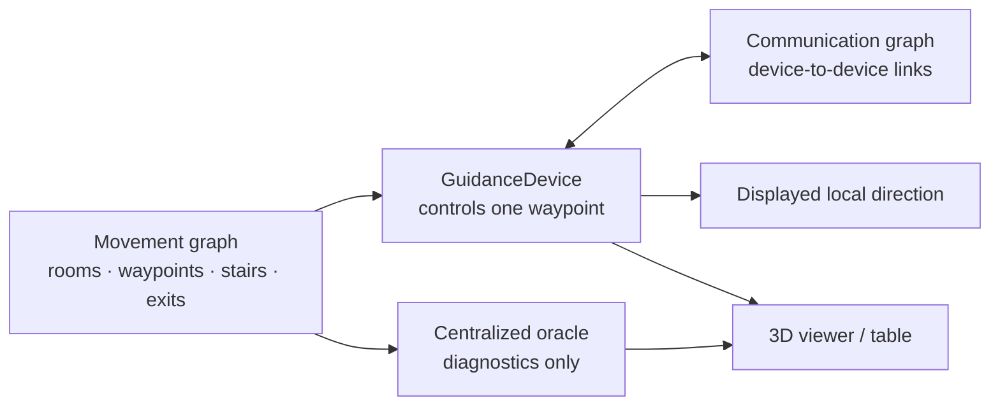
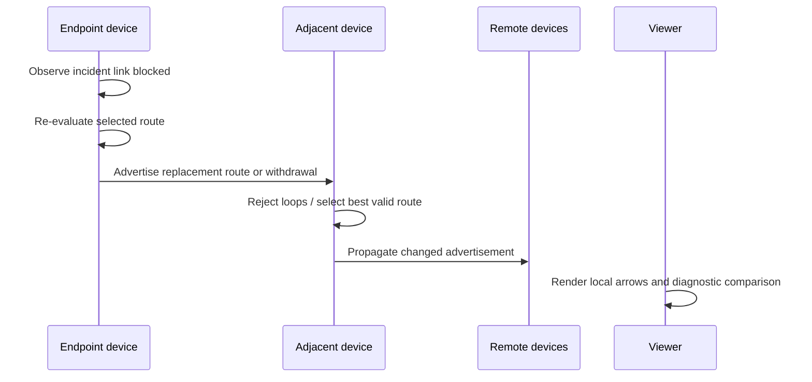

# Navilight


<video src="./navilight.mp4" controls preload></video>

**Navilight** is a proof-of-concept simulator for **distributed adaptive evacuation guidance** in a smart building.

Emergency guidance devices are attached to discrete routing waypoints. Each device independently selects the direction it displays using only:

- the state of movement links incident to its controlled waypoint;
- route advertisements received from devices at adjacent waypoints.

When a local passage becomes blocked, the affected devices withdraw or replace their route advertisements. The update propagates through the device network until valid exit directions are restored, or no direction is displayed where no exit-reaching route is known.

This is a routing and interaction prototype, not a certified evacuation controller.

## Model

| Layer | Representation | Purpose |
|---|---|---|
| Building geometry | `Space` objects | 3D visualization of floors, rooms, corridors and stairs |
| Movement topology | `networkx.Graph` | Walkable routing states and weighted links |
| Guidance devices | `GuidanceDevice` | Physical indicators controlling one routing waypoint |
| Communication topology | `CommunicationEngine` | Data links between nearby devices |
| Distributed routing | `DistributedPathVectorEngine` | Local route selection and propagation |
| Reference routing | `CentralizedBellmanStrategy` | Observer-side comparison only |
| Interaction/UI | `InteractiveBuildingViewer` | Edge blocking, stepping, rendering and diagnostics |

A movement node is a **routing state**, not necessarily a semantic place. Corridor-mounted indicators are represented by explicit `waypoint` nodes at their physical location.



## Deployment assumption

The demo installs one guidance device at every routing node:

```python
geometry.deploy_device_at_every_routing_node()
```

Devices controlling adjacent movement nodes must also be able to communicate. This condition is checked at startup:

```python
communication.validate_movement_adjacency_links(geometry.movement_graph)
```

This complete instrumentation is a proof-of-concept assumption. A physical deployment would explicitly define monitored links and controlled indicator locations.

## Distributed path-vector routing

Each device controls one node `x` and stores only:

- locally known incident links `(x, y)`, including traversal cost, blocked status and version;
- the latest route advertisement received from each adjacent device;
- its selected route advertisement.

A `RouteAdvertisement` contains:

```text
sender node, generation, reachable/withdrawn status,
destination exit, total cost, explicit path
```

For each unblocked incident link to neighbour `y`, device `x` evaluates:

\[
c(x,y) + A_y.cost
\]

where \(A_y\) is the last route advertised by the device controlling `y`.

A candidate is accepted only if:

- `y` advertises a reachable exit;
- the local link `(x, y)` is not blocked;
- `x` does not already appear in the advertised path;
- the downstream advertised path contains no duplicate nodes.

The selected route is:

\[
A_x = \arg\min_y \left(c(x,y) + A_y.cost\right)
\]

If no candidate is valid, the device advertises a **withdrawal**:

```text
reachable = false
cost = inf
path = ()
```

The path carried in advertisements prevents loop reuse after disconnections: a device cannot select an advertisement whose route already contains itself.



## Locality of decisions

In distributed mode, the direction displayed by a device is derived from its own selected route:

```text
controlled waypoint -> first hop in the local route advertisement
```

A device does **not** call Dijkstra, inspect a global route field, or request a centralized decision before displaying an arrow.

The global movement graph remains present in the simulator as the configured physical world and for visualization. `PathVectorDiagnostics` may compare distributed routes with an exact centralized route, but that comparison does not affect device decisions.

## Blocked links and unreachable regions

Physical edge changes are handled by `MovementGraphController`. A changed edge receives a monotonically increasing version, and the new local state is delivered only to devices at that edge's endpoints.

If both accesses from an upper-floor region to its stairs are blocked, internal devices cannot construct a valid exit-reaching advertised path. They converge to route withdrawal:

```text
cost = inf
next = -
no orange guidance arrow
```

This prevents the dead-end loops possible with the earlier full-table Bellman/gossip approach.

## Strategies

### `distributed-path-vector`

Default startup strategy. Orange arrows represent local guidance-device decisions.

### `centralized-bellman-oracle`

Synchronous Bellman relaxation over the complete movement graph. Blue arrows represent global reference directions.

It is available only for UI comparison and diagnostics; distributed devices do not use it.

## UI interactions

| Action | Effect |
|---|---|
| Pick node | Select a room as the displayed route origin |
| Pick edge | Toggle a physical movement link blocked/unblocked |
| Tick distributed | Advance one distributed message/update tick |
| Settle distributed | Run until no pending route updates remain |
| Next strategy | Switch between distributed view and centralized reference |
| Print device table | Print each device's selected local route state |
| Print path | Print the displayed route and exact diagnostic cost |
| Reset edges | Restore all physical movement links |

Rendering conventions:

| Colour | Meaning |
|---|---|
| Orange arrow | Local distributed guidance decision |
| Blue arrow | Centralized reference policy |
| Green path | Selected-start displayed route |
| Red edge | Blocked movement link |
| Cyan link | Communication graph edge |

## Code structure

| Component | Responsibility |
|---|---|
| `BuildingGeometry` | Builds visual spaces, routing topology and device deployment |
| `GuidanceDevice` | Indicator/controller associated with one explicit waypoint |
| `MovementGraphController` | Applies physical link events and versions |
| `CommunicationEngine` | Builds and validates device communication links |
| `CentralizedBellmanStrategy` | Computes global reference routing |
| `RouteAdvertisement` | Carries a selected route or explicit withdrawal |
| `RouteAgentState` | Stores one device's local links, inbox and selected route |
| `DistributedPathVectorEngine` | Executes local asynchronous route updates |
| `PathVectorDiagnostics` | Compares local routes against the exact reference |
| `DistributedPathVectorStrategy` | Exposes distributed state to the viewer |
| `InteractiveBuildingViewer` | Handles UI actions and 3D rendering |

## Run

Install dependencies:

```bash
pip install numpy networkx pyvista pytest
```

Start the simulator:

```bash
python working.py
```

Run protocol regression tests:

```bash
pytest -q test_working_protocol.py
```

## Scope and limitations

This implementation intentionally models a constrained proof-of-concept:

- one routing agent/device is deployed at each movement waypoint;
- adjacent movement waypoints require directly communicating devices;
- link failures are assumed to be detected by devices at the affected edge endpoints;
- the simulator does not currently model packet loss, latency, device failure or radio partition recovery;
- the centralized shortest-path reference is a diagnostic oracle, not part of distributed actuation;
- safety certification, emergency-code compliance and physical deployment constraints are outside scope.

The objective is to validate that local guidance devices can propagate and withdraw exit-route information without requiring global routing state to choose their displayed direction.
